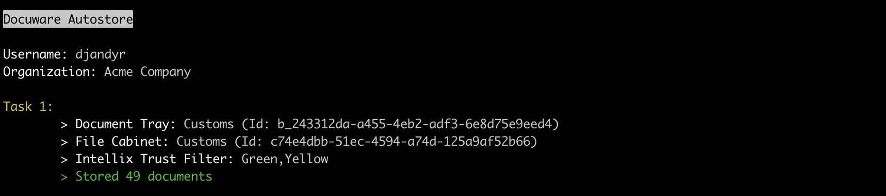

# Docuware Autostore

Automatically store documents from document tray to file cabinet using DocuWare REST API. Multiple tasks can be configured with different trays, intellix trusts levels, document title masks and processing limits.

This script addresses lack of automation within DocuWare cloud that forces logged in user to manually store each document in their tray, even if the intelligent indexing confidence score is high (green). For scenarios where DocuWare is used to intelligently index large volumes of archived documents or emails any manual intervention can quickly become unmaintainable.



## Install

Install Node Packages

```
npm install
```

Compile the code so it can be run, also required if any typescript files are changed

```
npx tsc
```

Create a new config.json autostore configuration in root folder. See [Example Configuration](#configuration)

Run AutoStore

```
npm run start --silent
```

## Command Arguments

`--config` to specify a different configuration file path other than default `./config.json`

```
npm run start -- --config ./other/config.json
```

` --dry-run` option to have autostore print document details without transferring any documents to file cabinet. This option can be used for testing filter patterns, or intellix trust levels.

```
npm run start -- --dry-run
```

## Configuration

```
{
	"rootUrl": "https://my.docuware.cloud/",
	"user": "username",
	"password": "password",
	"hostID": "7b5ed19b-bfd6-46e9-8a3b-efd2a4499666",
	"autoStore": [{
		"fileCabinetID": "c74e4dbb-51ec-4594-a74d-125a9af52b66",
		"documentTrayID": "b_243312da-a455-4eb2-adf3-6e8d75e9eed4",
		"storeDialogID": "c08ad9a4-2017-4705-b5d0-14dc3b84a5fe",
		"filters": [{
			"name": "IntellixTrust",
			"pattern": ["Green"]
		}],
		"keepSource": false
	}]
}
```

### Configuration Reference

* __rootUrl__

    Root URL of your DocuWare cloud instance

* __username__

    Username of full licensed DocuWare cloud user

* __password__

   Password of full licensed DocuWare cloud user    

* __hostID__

    Unique host identifier for the machine is required. This is used by the DocuWare license management around the faster reuse of licenses of users working on the same machine.

* __autoStore.fileCabinetID__

    DocuWare file cabinet GUID

* __autoStore.documentTrayID__

    DocuWare document tray GUID, also know as web basket. GUID is usually prefixed with `b_`
>
* __autoStore.storeDialogID__

    Store Dialog GUID. Store dialog maybe required if intelligent indexes are not pre-filled when transferring to file cabinet

* __autoStore.filters__    
   
   Filter source document properties with boolean matching glob patterns using wildcards (*, ? and !). Each filter accepts the following parameters:

   > For allowed properties please see [IDocument type interface](https://github.com/djandyr/docuware-autostore/blob/master/src/types/DW_Rest.d.ts)
   
   * name {String}: Document property (can be accessed using dot notation)
   * pattern {String|Array}: One or more glob patterns. See available [matching features](https://github.com/micromatch/micromatch#matching-features)
   * [options] {Object}: See available [options](https://github.com/micromatch/micromatch#options)
   ---
   Example 1: Filter source documents by Intellix Trust level. A source document will be only be stored if `Document.IntellixTrust` property is Green, or Yellow

        "filters": [
            {
                "name": "IntellixTrust",
                "pattern": ["Green","Yellow"]
            }
        ]
   
   Example 2: Filter source documents where Title contains one or more partial strings;

        "filters": [
            {
                "name": "Title",
                "pattern": ["*E2-XH-SADH*", "*X2-XH-SADH*"]
            }
        ]

* __autoStore.suggestions__

    Define which simple intellix field suggestions from Intelligent Indexing Service to be stored as document index value

   * name {String}: Field Database Name
   * filters {Object[]}: Filter Configuration
        > For allowed properties please see [IDocumentSuggestion type interface](https://github.com/djandyr/docuware-autostore/blob/master/src/types/DW_Rest.d.ts)
   
        * name {String}: Document suggestion field property
        * pattern {String|Array}: One or more glob patterns. See available [matching features](https://github.com/micromatch/micromatch#matching-features)
        * [options] {Object}: See available [options](https://github.com/micromatch/micromatch#options)
   ---

   Example 1: Use only intellix suggestions fields subject and company where intellix confidence is green, or yellow

    ```
        "suggestions": [
            {
                "name": "SUBJECT",
                "filters": [{
                    "name": "Confidence", "pattern": ["Green","Yellow"]
                }]
            },
            {
                "name": "COMPANY",
                "filters": [{
                    "name": "Confidence", "pattern": ["Green","Yellow"]
                }]
            }
        ],

    ```

* __autoStore.keepPreFilledIndexes__    

  If this flag is true, and suggestion field configuration has been defined. Any pre-filled indexes in source documents will be preserved. If false, indexes will be set to null

* __autoStore.keepSource__    

    If this flag is true the source documents remain in the document tray; otherwise they are removed from document tray

* __autoStore.limit__ 

    Limit the number of files returned from document tray for processing. Default set to 100

## FAQ

__How do I find my File Cabinet ID?__

1. Navigate to DocuWare Configurations > File Cabinets
2. Click "Edit" icon on your File Cabinet
3. Click "More Options" hyperlink
4. Note GUID of the file cabinet

__How do I find my Document Tray ID?__

1. Open the following service URL from your Docuware Cloud instance in your browser `https://my.docuware.cloud/DocuWare/Platform/FileCabinets`
2. Search for `@AssignedCabinetId="Your File Cabinet ID"`
3. If File Cabinet `@IsBasket = "true"` and `@Id` prefixed with `_b`
4. Note `@Id`

__How do I find my Store Dialog ID?__

1. Navigate to DocuWare Configuration > File Cabinets 
2. Click "Edit" icon on your File Cabinet
3. Select "Dialog" tab
4. Click on the name your preferred Store Dialog
5. Click "More Options"
6. Note "ID"